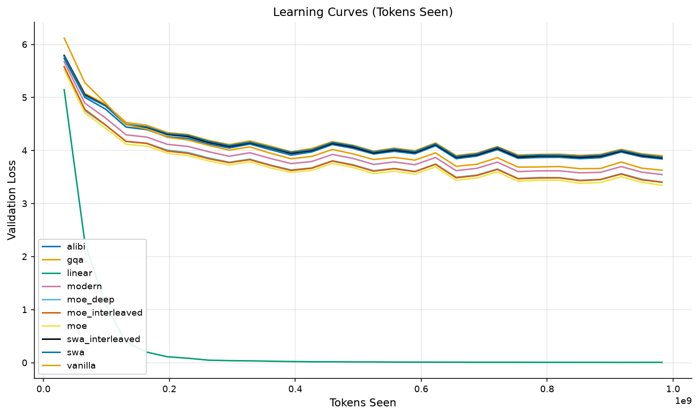
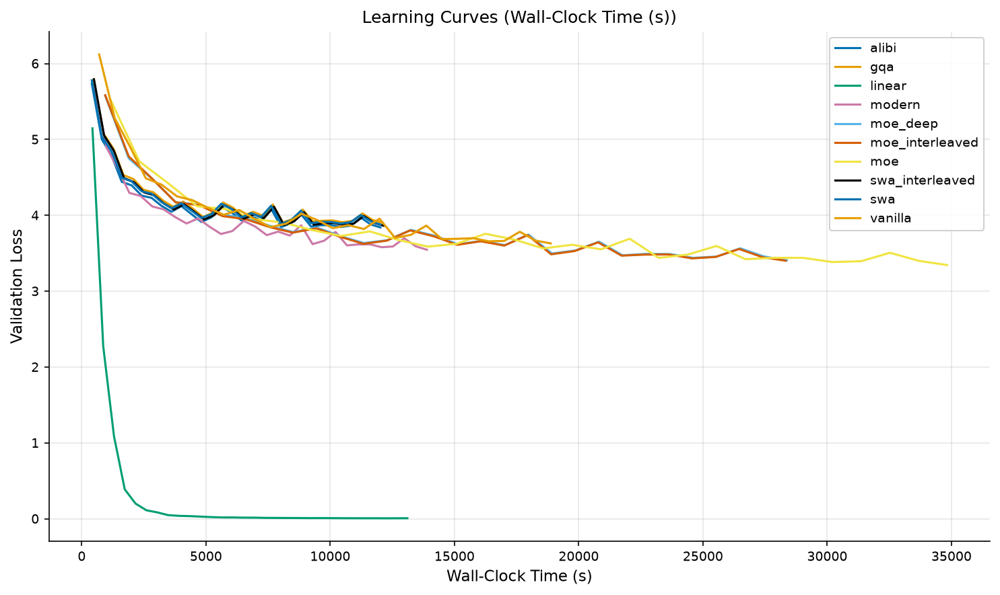
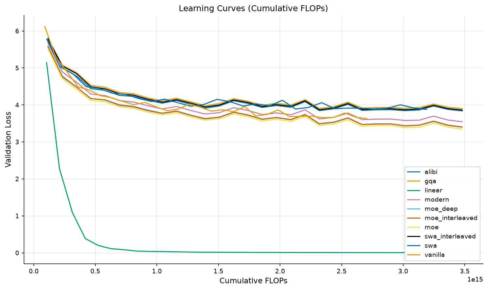
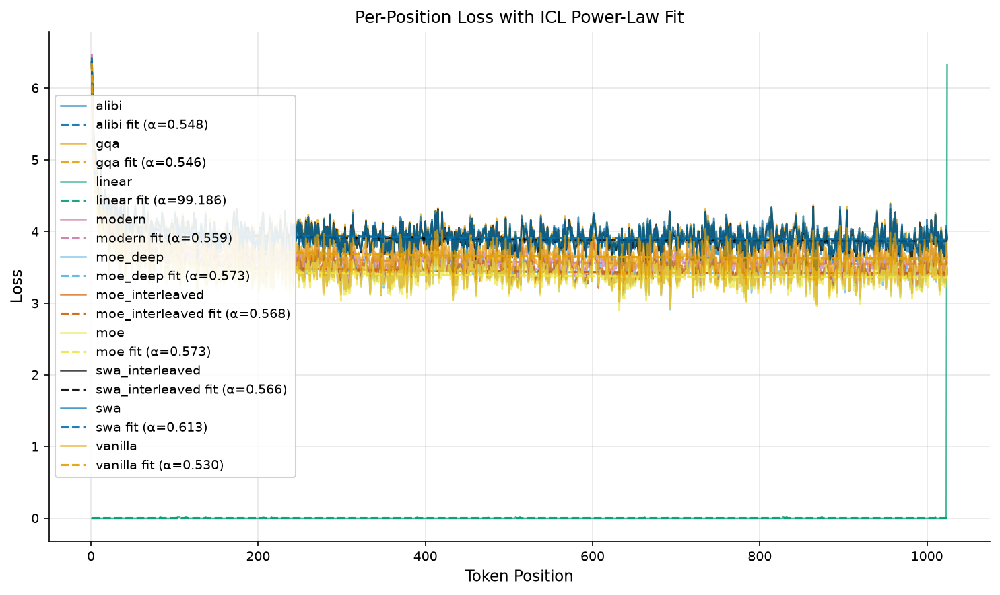
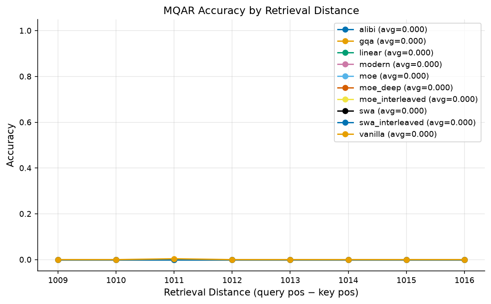
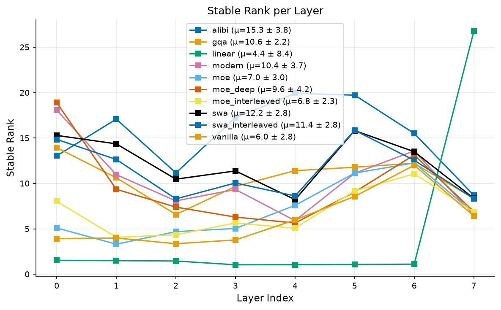
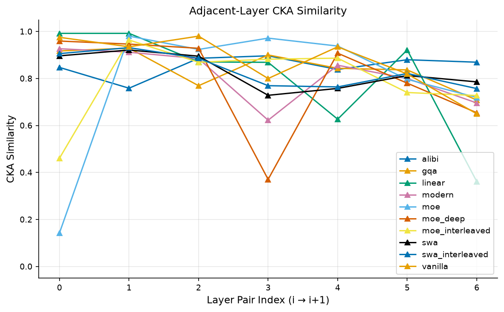
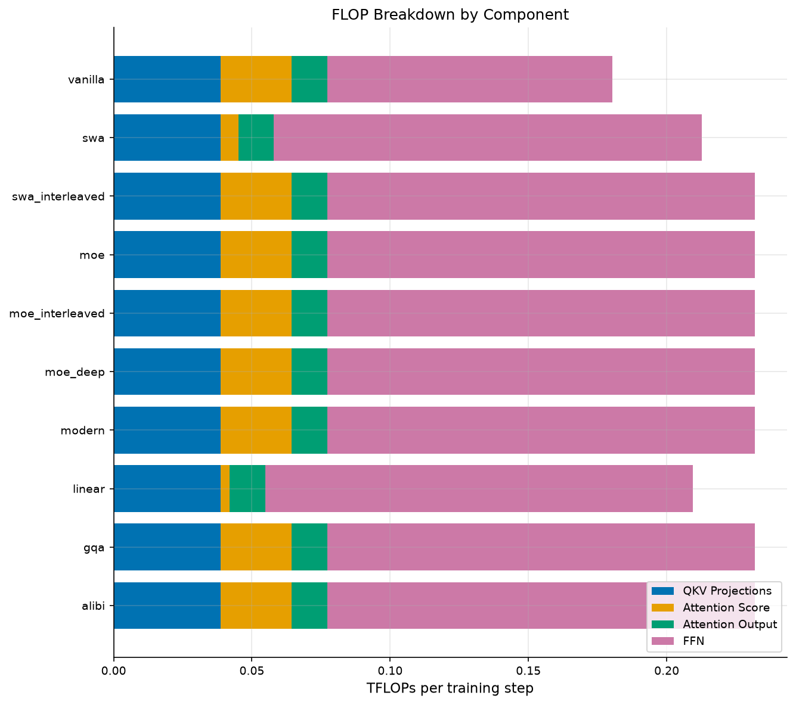
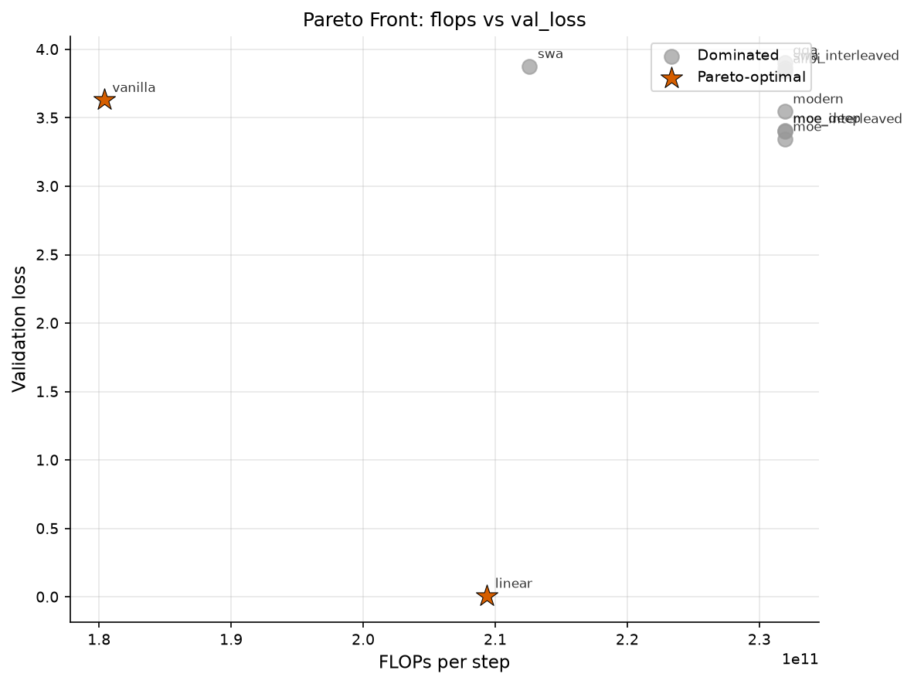
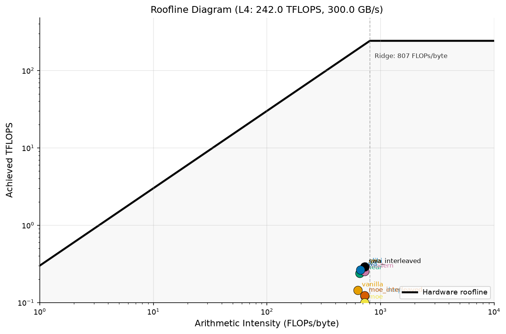

# Evaluation Summary Report

Automated comparison of Transformer variant architectures across
controlled evaluation axes: fixed-data, fixed-wallclock, and fixed-FLOPs.

## Fixed-Data Comparison

Validation loss at the same token budget.

| Variant | Val Loss |
|---------|----------|
| alibi | 3.8408 |
| gqa | 3.9033 |
| linear | 0.0079 |
| modern | 3.5471 |
| moe | 3.3450 |
| moe_deep | 3.4067 |
| moe_interleaved | 3.4019 |
| swa | 3.8777 |
| swa_interleaved | 3.8638 |
| vanilla | 3.6301 |

## Fixed-Wallclock Comparison

Validation loss at fractions of the dynamic wall-clock budget.

| Variant | 25% | 50% | 75% | 100% |
|---------|-----|-----|-----|------|
| alibi | 4.1792 | 4.0428 | 3.9385 | 3.8408 |
| gqa | 4.2695 | 4.1140 | 4.0279 | 3.9099 |
| linear | 0.0871 | 0.0181 | 0.0098 | 0.0072 |
| modern | 4.1032 | 3.7886 | 3.7687 | 3.5834 |
| moe | 4.5403 | 4.0587 | 3.8273 | 3.7467 |
| moe_deep | 4.4250 | 3.9921 | 3.8111 | 3.6616 |
| moe_interleaved | 4.4271 | 3.9750 | 3.8029 | 3.6549 |
| swa | 4.2323 | 4.0884 | 3.9823 | 3.8777 |
| swa_interleaved | 4.2392 | 4.0875 | 4.0117 | 3.8764 |
| vanilla | 4.4324 | 4.0369 | 3.9985 | 3.9418 |

## Fixed-FLOPs Comparison

Validation loss at the same cumulative FLOP budget.

| Variant | Val Loss |
|---------|----------|
| alibi | 3.8587 |
| gqa | 3.9210 |
| linear | 0.0078 |
| modern | 3.6082 |
| moe | 3.4281 |
| moe_deep | 3.4792 |
| moe_interleaved | 3.4732 |
| swa | 3.9029 |
| swa_interleaved | 3.8829 |
| vanilla | 3.6301 |

## Parameter Parity

❌ **FAIL** — Parameter counts exceed ±5% tolerance.

| Variant | Parameters |
|---------|------------|
| alibi | 59,294,720 |
| gqa | 56,148,992 |
| linear | 59,294,720 |
| modern | 59,294,720 |
| moe | 59,294,720 |
| moe_deep | 59,294,720 |
| moe_interleaved | 59,294,720 |
| swa | 59,294,720 |
| swa_interleaved | 59,294,720 |
| vanilla | 51,430,400 |

## Pareto Front

Pareto-optimal variants (non-dominated on FLOPs vs val_loss):

- **linear**
- **vanilla**

## Figures

### Learning Curves

### Per-Position Loss

### Probes

### Efficiency

